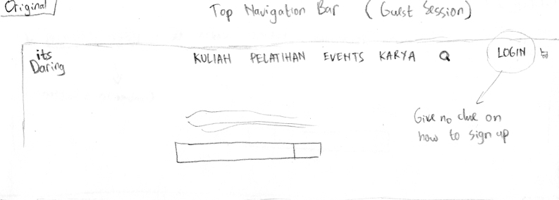
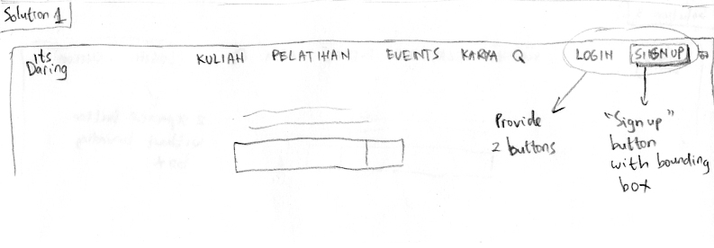
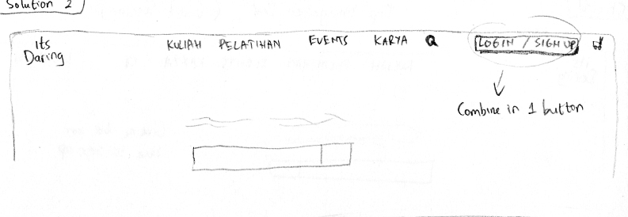
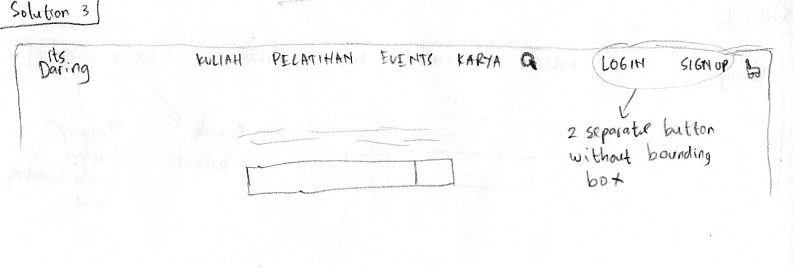
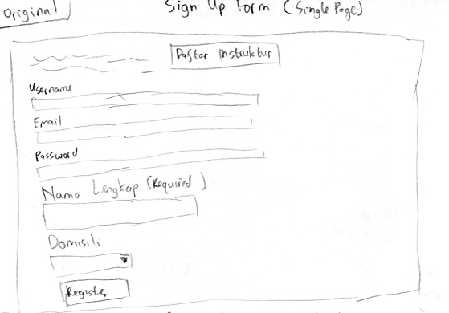
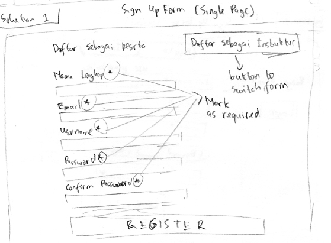
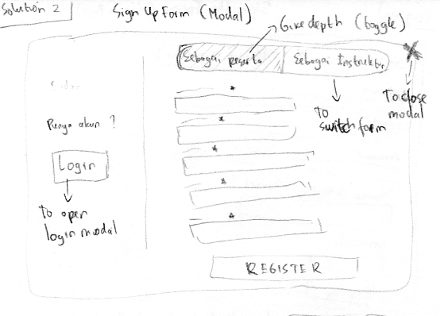
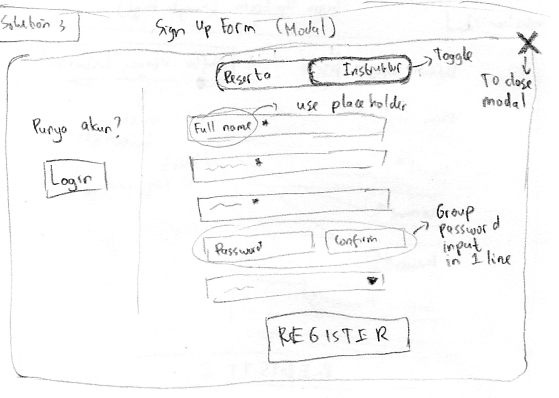

- [Sketching and Prototyping](#sketching-and-prototyping)
  - [Part A: Sketches](#part-a-sketches)
    - [1. Scan/Photo of Sketches](#1-scanphoto-of-sketches)
      - [1.1 Explicit Sign Up Button](#11-explicit-sign-up-button)
      - [1.2 Sign Up Form](#12-sign-up-form)
    - [2. Version Differences](#2-version-differences)
      - [2.1 Explicit Sign Up Button](#21-explicit-sign-up-button)
        - [Problem](#problem)
        - [Solution 1](#solution-1)
        - [Solution 2](#solution-2)
        - [Solution 3](#solution-3)
      - [2.2 Sign Up Form](#22-sign-up-form)
        - [Problem](#problem-1)
        - [Solution 1](#solution-1-1)
        - [Solution 2](#solution-2-1)
        - [Solution 3](#solution-3-1)
    - [3. Selected Sketch](#3-selected-sketch)
      - [Explicit Sign Up Button](#explicit-sign-up-button)
      - [Sign Up Form](#sign-up-form)
    - [4. Design Rationale](#4-design-rationale)
  - [Part B: Assumptions](#part-b-assumptions)
    - [1. Hardware](#1-hardware)
    - [2. Users](#2-users)
  - [Part C: Prototypes](#part-c-prototypes)
# Sketching and Prototyping
Using the information in the results of Assignment 1 for what is good and bad about the UI for designed tasks, we are going to make **Sketches** and **Prototypes**. These sketches and prototypes will lead to better design in Assignment 3. The prototypes will be then tested through a usability evaluation followed by design revision in Assignment 4.

## Part A: Sketches
Sketch at least **3 (three)** different UIs for the functions you are targeting. These three interfaces should be _dramatically different_ in terms of design directions. For example, they can be with different organizations of what functions on each screen or using a different layout of the icons, widgets, and menus on the screens. If you want, you can also incorporate non-on-screen UIs: physical buttons, gestures through motion sensors, etc.

You need **not** sketch the whole interface. It is not necessary for the sketches to have every function or every function in detail, but there should be enough to show off your general idea. **Be creative!** Draw your idea and label a few of the widgets so we can tell your intent. The goal is to have at least 3 good UIs in *interesting* ways. Sketches should be done on paper with pens and/or pencils (do not use a computer).

### 1. Scan/Photo of Sketches
#### 1.1 Explicit Sign Up Button
**Original**
  
**Solution 1**
  
**Solution 2**
  
**Solution 3**
  
#### 1.2 Sign Up Form
**Original**
  
**Solution 1**
  
**Solution 2**
  
**Solution 3**
  

### 2. Version Differences

#### 2.1 Explicit Sign Up Button
##### Problem
There is no clear or straightforward indication about how to access sign up page bacause the sign up form is located inside login modal.
##### Solution 1
Add new sign up button beside login button. It is a 3D button with different color (brighter) which may help to attract more attention from user in a guest session who want to create an account. Also help user to quickly access sign up page in 1 click.
##### Solution 2
Add "Sign Up" beside "Login" in the old login button. Change the button into 3D button with brighter color.
##### Solution 3
Add new button beside Login button with the same style as the other buttons in top navigation bar.

#### 2.2 Sign Up Form
##### Problem
- Inconsistent field label's font size
- No validation for required field
- No clear info what kind of account we will have (student / intructor)
- Inconsistent input field's width
##### Solution 1
- Add information on top about what type of account will be created
- Add '*' next to field label to indicate a required field
- Adjust font size
##### Solution 2
- Change sign up form into modal (no need to open new page)
- Split into 2 view, left to quickly access login modal, right one for form
- Switch between student and instructor form using toggle, the active one will have darker color and depth effect
##### Solution 3
- Remove field label and use only placeholder
- Switch between student and instructor form using slide toggle
- Group password and confirm password input field in the same line
### 3. Selected Sketch
#### Explicit Sign Up Button
I choose **solution 1**, because it helps to clearly show "*you have to click this to sign up*" by its 3D effect and brighter color. Separation of login and sign up button also help to reduce the number of click needed to access sign up form to only 1 click.
#### Sign Up Form
I choose **solution 3**, because it can arrange the input field nicely, use minimum space (without field label), and tell the user what kind of account they are going to make clearly from the slide toggle state. The use of modal insted of separate page also reduce the time needed to access a new page bacause of traffic from server.
### 4. Design Rationale
When doing teh inquiry process, I can see that the presence of *explicit* sign up button is a must because user take a while to find the way to create an account, that's why I try to give user a direction by using a visually different component to attract them. And some of their main features still not served in just a few clicks away, that add additional time to access frequent features. Also the use of minimal space which help user to quickly navigating through the web view to quickly understand what they are looking at. By adding new element or modifying old ones, I try to create something similiar to its original design style.

## Part B: Assumptions
### 1. Hardware
- Screen size : min. 14 inch
- Screen resolution : min. 1366 x 768 pixel with 16:9 aspect ratio
- Screen type : color
- Input device : touchscreen, mouse, keyboard

### 2. Users
- Occupation : student or teacher / lecturer
- Familiar with dynamic site
- Familiar with e-learning system
- In the range of 16 - 60 years old
## Part C: Prototypes
[Freehand Drawing](https://projects.invisionapp.com/freehand/document/WL2R6YvuC)

